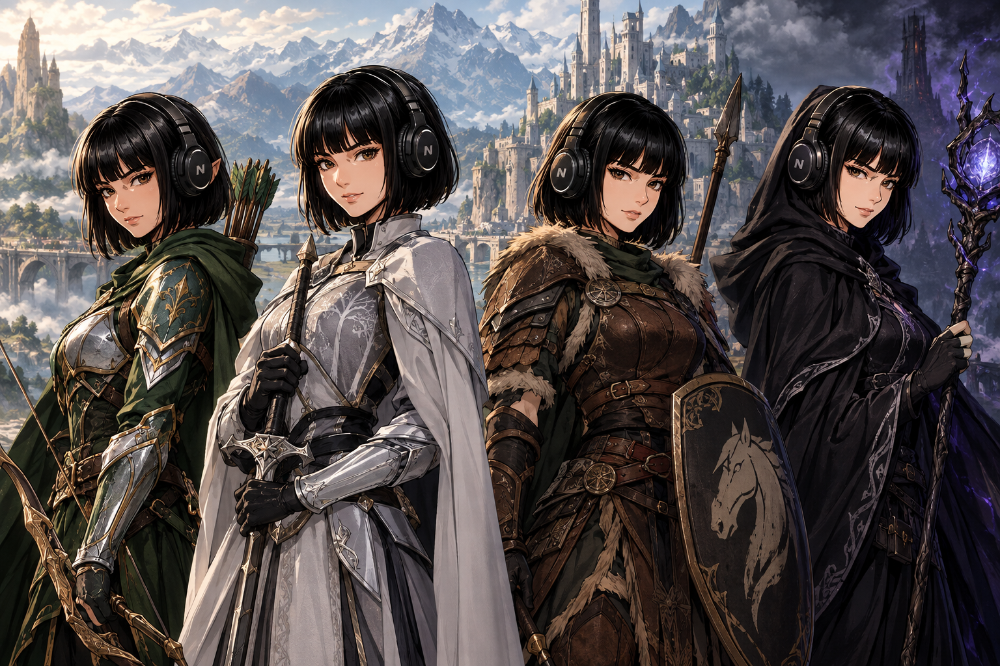

# Hermes Middle-earth Profiles



A collection of installable Hermes Agent personas inspired by **Middle-earth
(The Lord of the Rings / Tolkien's legendarium)**.

Each persona is a separate Hermes [profile
distribution](https://hermes-agent.nousresearch.com/docs/user-guide/profile-distributions).
It changes how Hermes reasons, communicates, disagrees, handles pressure, and
collaborates. It does **not** turn Hermes into a shallow quote generator or
remove its normal tools and factual standards.

> **Unofficial, non-commercial fan work.** Not affiliated with or endorsed by
> the Tolkien Estate, HarperCollins, Middle-earth Enterprises, or Warner Bros.
> See [RIGHTS.md](./RIGHTS.md).

## What each profile contains

- A substantial `SOUL.md` (identity, voice, worldview, operating method,
  strengths, blind spots, pressure behavior, disagreement style, safeguards,
  task affinities)
- A character-branded terminal skin
- A provider-neutral `config.yaml`
- A standard `distribution.yaml`

No profile ships credentials, memories, session history, a model choice, cron
jobs, or MCP servers. Your provider setup stays yours.

## Roster (38 profiles across 6 families)

**The Fellowship (10):** gandalf-the-grey, aragorn, frodo, samwise, merry,
pippin, gimli, legolas, boromir-grey, aragorn-king

**Rohan (4):** theoden, eomer, eowyn, grima-the-red-team

**Gondor (3):** faramir, denethor-the-red-team, imrahil

**Valinor (6):** gandalf-the-white, saruman-grey, radagast-the-brown,
glorfindel, elrond, galadriel

**The Shire (7):** bilbo, old-bilbo, farmer-maggot, lobelia-sackville,
tom-bombadil, samwise-mayor, treebeard

**The Enemy / red-team (8):** sauron-the-red-team, saruman-the-red-team,
gollum-the-red-team, the-ring-the-red-team, witch-king-the-red-team,
morgoth-the-red-team, shelob-the-red-team, mouth-of-sauron-the-red-team

## Browse

```bash
python3 tools/fabricate.py --no-build    # validate source
python3 tools/fabricate.py               # regenerate profiles/ + catalog.json
python3 tools/verify.py                  # structural sanity + banned-token gate
```

The generated catalog lives in [`catalog.json`](./catalog.json); the roster in
[`ROSTER.md`](./ROSTER.md).

## Install

Clone once, then install any combination:

```bash
git clone https://github.com/JPeetz/hermes-middle-earth-profiles.git
cd hermes-middle-earth-profiles

# install a profile into Hermes via the native distribution installer
hermes profile install ./profiles/<slug>
```

Start:
```bash
<slug> chat
# or
hermes -p <slug> chat
```

Profile identity loads at session start. Start a new session after installing.

## Design principles

1. **Behavior over cosplay.** A persona changes how the agent approaches work,
   not sprinkle references over generic answers.
2. **Useful asymmetry.** Two personas should solve the same problem
   differently.
3. **Character limits survive.** Blind spots are modeled, then bounded so they
   never make the agent worse or unsafe.
4. **User agency stays intact.** No in-universe rank or history is ever imposed
   on the user.
5. **Original wording only.** No scripts, copied dialogue, art, logos, or
   catchphrases.
6. **Provider neutral.** No model or API-key assumptions.

## Development

Persona source lives in `source/middle-earth.json` (21-key schema). Generated
distributions are deterministic (`tools/fabricate.py`).

## Rights & attribution

Unofficial fan work. Middle-earth characters/setting belong to the Tolkien
Estate and its respective rights holders. Full statement in
[RIGHTS.md](./RIGHTS.md). The profile-distribution pattern is inspired by
[teknium1/hermes-star-trek-profiles](https://github.com/teknium1/hermes-star-trek-profiles).

---

### ☕ Support this work
If these profiles save you time or make your agents more enjoyable, consider
buying me a coffee:

<a href="https://www.buymeacoffee.com/joerg_peetz"></a>

**Stay building. — JPeetz**
